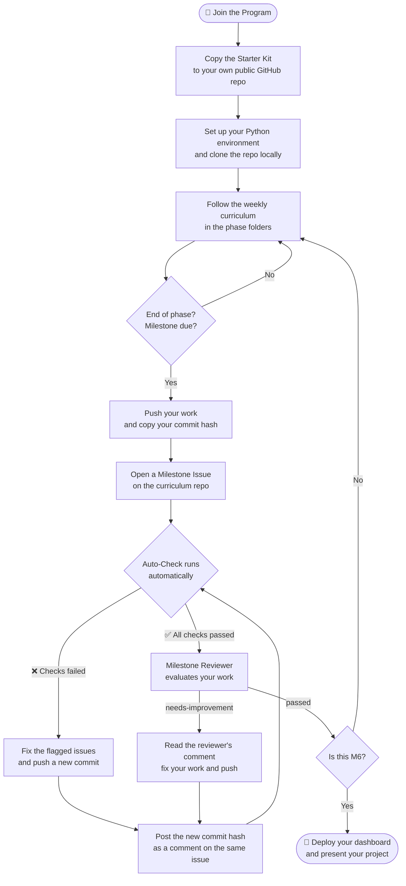

# DEP Data Engineering Starter Kit

Welcome to the **Data Engineering Pilipinas Open Track**. This folder is your project scaffold — everything you need to build one real, deployable data project over 24 weeks.

---

## Your Journey at a Glance



---

## Before You Start

You need:
- A free [GitHub account](https://github.com)
- [Python 3.10+](https://www.python.org/downloads/) installed on your machine
- [Git](https://git-scm.com/) installed and configured

---

## Step 1 — Copy This Starter Kit to Your GitHub

You need to create your own GitHub repo with the starter kit files inside. Follow the steps below based on what you're comfortable with.

---

### Option A — Download and Upload (No Git knowledge required)

#### 1. Create a new GitHub repo

1. Go to [github.com](https://github.com) and sign in
2. Click the **+** icon in the top-right corner → **New repository**
3. Name it something like `dep-data-engineering-<your-name>` (e.g. `dep-data-engineering-juan`)
4. Set visibility to **Public** ← required
5. Check **Add a README file**
6. Click **Create repository**

#### 2. Download the starter kit files

1. Go to the [curriculum repo](https://github.com/dataengineeringpilipinas/dep-data-engineering-open-track)
2. Click the green **Code** button → **Download ZIP**
3. Extract the ZIP on your computer
4. Open the extracted folder and navigate to `cohorts/starter-kit/`
5. You should see folders like `data/`, `scripts/`, `notebooks/`, `dashboard/`, and files like `requirements.txt` and `README.md`

#### 3. Upload the files to your new repo

1. Open your newly created GitHub repo
2. Click **Add file → Upload files**
3. Drag all the contents from inside `cohorts/starter-kit/` into the upload area (not the folder itself — the files and folders inside it)
4. Scroll down, write a commit message like `Initial commit from DEP starter kit`
5. Click **Commit changes**

---

### Option B — Using Git (Recommended if you know the command line)

#### 1. Create your GitHub repo

1. Go to [github.com](https://github.com) → **+** → **New repository**
2. Name it `dep-data-engineering-<your-name>`, set to **Public**, do NOT initialize with a README
3. Click **Create repository** and copy the repo URL

#### 2. Set up your local repo with the starter kit

Run these commands in your terminal, replacing the placeholders:

```bash
# Clone the curriculum repo to get the starter kit
git clone https://github.com/dataengineeringpilipinas/dep-data-engineering-open-track.git

# Copy the starter kit into a new folder
cp -r dep-data-engineering-open-track/cohorts/starter-kit/. dep-data-engineering-<your-name>/

# Go into your new project folder
cd dep-data-engineering-<your-name>

# Set up git and push to your GitHub repo
git init
git add .
git commit -m "Initial commit from DEP starter kit"
git branch -M main
git remote add origin https://github.com/<your-username>/dep-data-engineering-<your-name>.git
git push -u origin main
```

---

> **Your repo must be public at all times** so reviewers and the auto-checker can access it. Do not make it private at any point during the program — even temporarily. If your repo is private when you submit, the auto-check will fail and your submission will not be reviewed.

---

## Step 2 — Clone Your Repo Locally

```bash
git clone https://github.com/<your-username>/<your-repo-name>.git
cd <your-repo-name>
```

---

## Step 3 — Understand the Folder Structure

```text
your-repo/
├── data/
│   ├── raw/            ← Phase 2: raw data files go here
│   └── processed/      ← Phase 3: cleaned/transformed data goes here
├── scripts/
│   ├── ingest.py       ← Phase 2: your data ingestion script
│   └── transform.py    ← Phase 3: your data transformation script
├── notebooks/          ← Phase 4 & 5: your analysis notebooks
├── output/
│   └── figures/        ← Phase 4: saved charts and visuals
├── dashboard/
│   └── index.html      ← Phase 6: your deployed dashboard or report
├── requirements.txt    ← list all your Python dependencies here
└── README.md           ← this file — update it as your project grows
```

You will fill in each folder phase by phase. Do not try to fill everything at once.

---

## Step 4 — Set Up Your Python Environment

```bash
python -m venv venv
source venv/bin/activate        # Mac/Linux
venv\Scripts\activate           # Windows

pip install -r requirements.txt
```

Add any new packages you install to `requirements.txt`:

```bash
pip freeze > requirements.txt
```

---

## Step 5 — Work Through the Phases

| Phase | Weeks | What you build |
| ----- | ----- | -------------- |
| 1 — Foundations | 1–4 | Define your problem, find your data source, set up this repo |
| 2 — Data Collection | 5–6 | Write `scripts/ingest.py`, pull raw data into `data/raw/` |
| 3 — Data Processing | 7–12 | Write `scripts/transform.py`, clean and model data in `data/processed/` |
| 4 — Analysis & Insights | 13–16 | Explore data in `notebooks/`, produce charts in `output/figures/` |
| 5 — Predictive / Alt Track | 17–20 | Build a model (Path A) or advanced analysis (Path B) |
| 6 — Deployment | 21–24 | Deploy `dashboard/index.html` via GitHub Pages, prepare your demo |

---

## Step 6 — Submit at Each Milestone

At the end of each phase, submit a milestone issue on the **curriculum repo**:

1. Go to [github.com/dataengineeringpilipinas/dep-data-engineering-open-track/issues/new/choose](https://github.com/dataengineeringpilipinas/dep-data-engineering-open-track/issues/new/choose)
2. Select the template matching your milestone (e.g. **Milestone 1 — Foundations Complete**)
3. Fill in your name, cohort, repo URL, and **commit hash**

**How to get your commit hash:**

```bash
git log --oneline -1
# Example output: a1b2c3d feat: add ingestion script
# Your commit hash is: a1b2c3d (or the full 40-character version)
```

Copy the full hash:

```bash
git log -1 --format="%H"
```

After you submit, the auto-checker will run and post a comment on your issue within a few minutes. Fix anything flagged before waiting for a reviewer.

**What happens next:**

| Step | Who | What |
| ---- | --- | ---- |
| Auto-Check | Bot | Clones your repo at the commit hash and checks for required files. Posts ✅/❌ per item. |
| Fix & Resubmit | You | If any check fails, fix the issue, push a new commit, and post the new commit hash as a comment on the same issue. The auto-check re-runs automatically. |
| Review | Volunteer | Once all checks pass, a Milestone Reviewer reads your work and applies one of two labels. |
| `passed` | Reviewer | You're clear to move to the next phase. |
| `needs-improvement` | Reviewer | The reviewer leaves one specific comment. Fix it, push a new commit, and post the new commit hash as a comment on the same issue. |

> Reviewers aim to respond within **5 days**. If you haven't heard back in 7 days, post in the Discord community channel and tag your moderator.

**How to resubmit after a `needs-improvement` verdict:**

```bash
# Fix your work, then:
git add .
git commit -m "fix: address reviewer feedback"
git push

# Get your new commit hash:
git log -1 --format="%H"

# Paste the hash as a comment on your existing milestone issue — do NOT open a new issue.
```

---

## Step 7 — Enable GitHub Pages (Phase 6)

To deploy your dashboard:

1. In your repo, go to **Settings → Pages**
2. Under **Source**, select **Deploy from a branch**
3. Choose `main` branch and `/dashboard` folder
4. Click **Save** — your live URL will appear as `https://<your-username>.github.io/<your-repo-name>/`

---

## Updating Your README

Replace this file with your own project README as you progress. At minimum, your README should include:

- What problem you are solving
- Where your data comes from
- How to run your scripts (`ingest.py`, `transform.py`)
- Your key findings (Phase 4+)
- Your live dashboard URL (Phase 6)

---

## Getting Help

- Check the weekly READMEs in the curriculum repo for topic guides and resources
- Post in the community Discord if you are stuck after 2 hours on a problem
- Review `docs/FAQ.md` in the curriculum repo for common questions

---

## Milestone Quick Reference

| Milestone | When | What reviewers check |
| --------- | ---- | -------------------- |
| M0 | Week 1 | Repo is public, README describes your project |
| M1 | Week 3–4 | Folder structure exists, requirements.txt present |
| M2 | Week 6 | `ingest.py` runs, `data/raw/` has real data |
| M3 | Week 12 | `transform.py` runs, `data/processed/` has output |
| M4 | Week 16 | Notebook exists and runs end-to-end |
| M5 | Week 20 | Pipeline is connected, path-specific outputs saved |
| M6 | Week 24 | Dashboard is live at a public URL |
